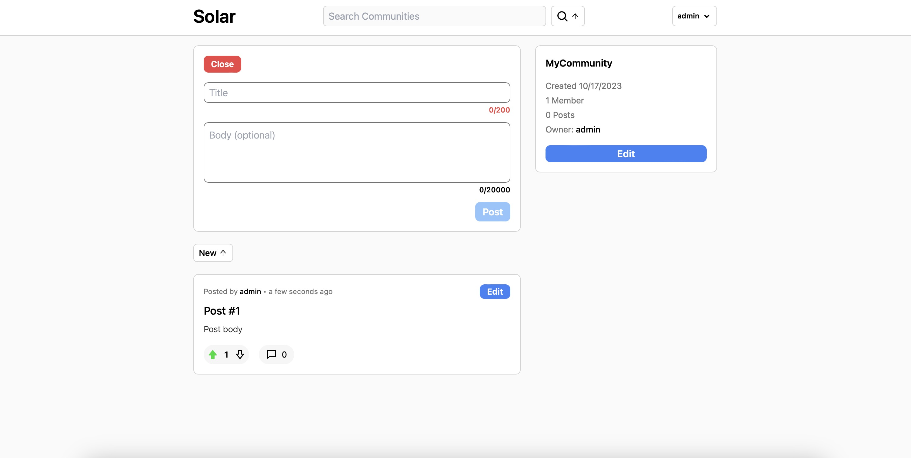
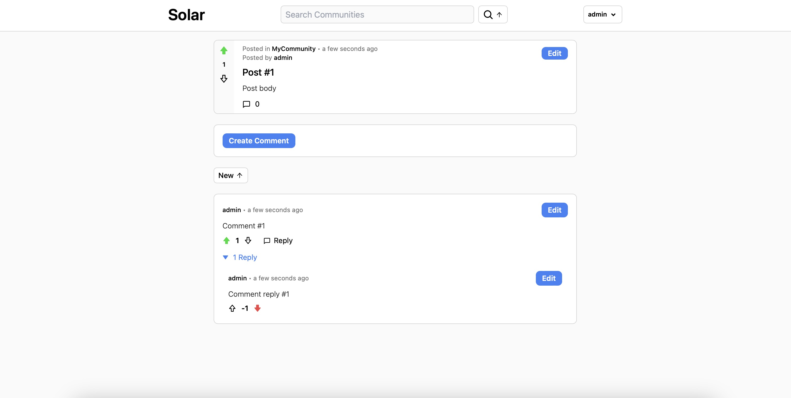
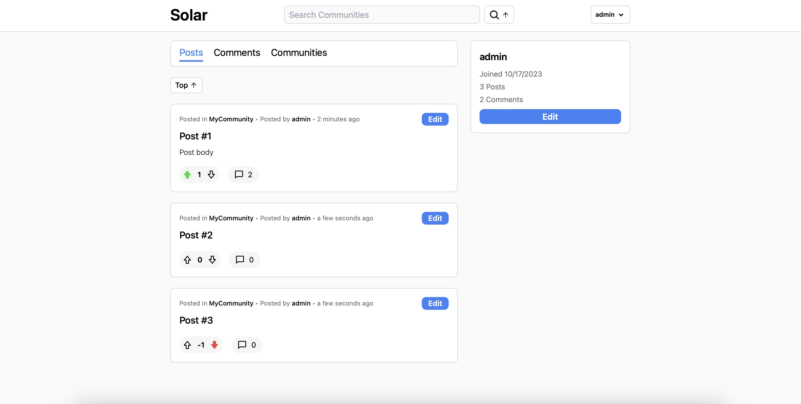
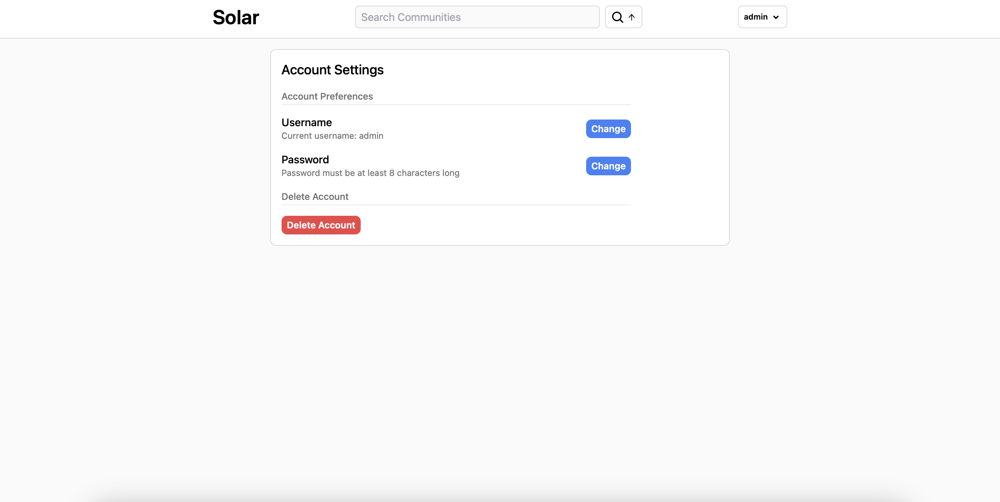

<h1>Solar, a Reddit-Inspired Social Media Web Application</h1>

Solar is a responsive web application based off of Reddit.

Tech stack: React, Typescript, Tailwind CSS, Prisma (ORM), Express, GraphQL, and PostgreSQL.

Features:

<ol>
  <li>Username and password sign up and login</li>
  <li>Create, edit, and delete posts, comments, and communities</li>
  <li>Upvote and downvote posts and comments</li>
  <li>Join communities</li>
  <li>Reply to comments</li>
  <li>Search for communities and users by name</li>
  <li>Sort posts and comments based on creation date and vote count</li>
  <li>Profile page that contains:</li>
  <ol>
    <li>Created posts and comments</li>
    <li>Created and joined communities</li>
  </ol>
</ol>

<h2>Testing</h2>

Front end and back end testing completed using Cypress. The tests are located at client/cypress/e2e. Database seeding materials are located at server/prisma/seed.

<h2>Demo</h2>

Click here to view a demo of the website.

https://github.com/inadeauu/solar/assets/123025115/dec62bce-0611-4c19-80fc-98efce12cac5

<h2>Local Install Instructions</h2>

To locally install and run this project on your machine:

<ol>
  <li>Clone this GitHub repository</li>
  <li>Within both the client and server folders, run "npm i"</li>
  <li>Create and run a PostgresQL database named "solar" at localhost:5432</li>
  <li>Within the server folder, run "npx prisma db push"</li>
  <li>Within the server folder, run "npm run dev"</li>
  <li>Once the server is running, within the client folder, run "npm run dev"</li>
  <li>Navigate to localhost:5173 in a web browser</li>
</ol>

<h2>Images</h2>
<h3>Community Page</h3>

<h3>Post Page</h3>

<h3>Profile Page</h3>

<h3>Profile Edit Page</h3>

